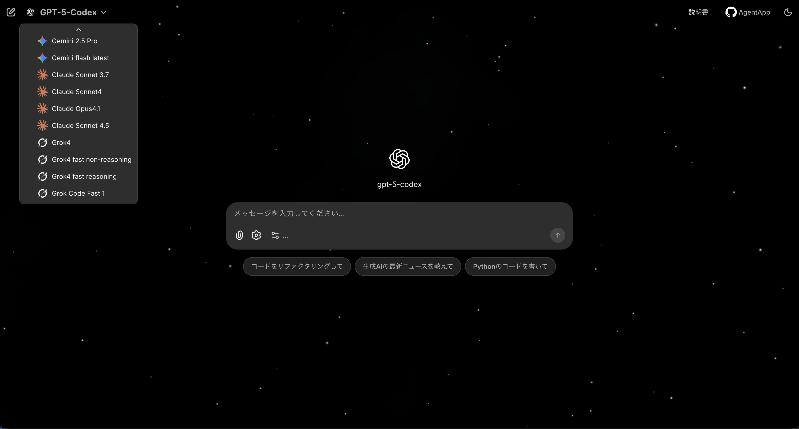

# AI Chat Application

複数のAIモデル（OpenAI, Gemini, Claude, Grok）と対話できるチャットアプリケーションです。


## 特徴

- 複数のAIモデルを切り替えて利用可能
- 対話履歴の管理
- カスタマイズ可能なシステムプロンプト

## セットアップ

1. 前提
   - Python 3.10〜3.12 を推奨
   - pip が利用可能であること

2. リポジトリをクローン
   ```bash
   git clone [リポジトリのURL]
   cd [リポジトリ名]
   ```

3. 依存関係のインストール
   ```bash
   pip install -r requirements.txt
   ```
   - Chainlit の認証・データレイヤーは PostgreSQL ドライバの `asyncpg` をロードするため、上記コマンドでこのパッケージも必ずインストールされます。仮想環境を作り直した場合などは再度 `pip install -r requirements.txt` を実行し、`asyncpg` が入っていることを確認してください。

4. 環境変数の設定（`.env` を作成）
   ```bash
   OPENAI_API_KEY=your_openai_api_key
   GOOGLE_API_KEY=your_google_api_key
   ANTHROPIC_API_KEY=your_anthropic_api_key
   XAI_API_KEY=your_xai_api_key
   # Chainlitのログインに利用する資格情報
   # 単一ユーザーの場合は従来どおり USERNAME / PASSWORD を指定
   CHAINLIT_USERNAME=your_login_id
   CHAINLIT_PASSWORD=your_login_password
   # 複数ユーザーを許可する場合は下記のいずれかを利用
   # CHAINLIT_USERS="alice@example.com=alice-pass;bob@example.com=bob-pass"
   # CHAINLIT_USERS_JSON='{"carol@example.com": "carol-pass"}'
   # CHAINLIT_USERS_FILE=.chainlit/users.json
   # JWTベースの認証セッションを有効化する場合はシークレットも設定
   CHAINLIT_AUTH_SECRET=secret_generated_by_chainlit_cli
   # チャット履歴を永続化するSQLiteの保存先（未設定の場合は自動で ./.chainlit/local-data.db を利用）
   # DATABASE_URL=sqlite+aiosqlite:///absolute/path/to/.chainlit/local-data.db
   ```

## 起動方法
```bash
chainlit run app.py -w
```

アプリケーションは http://localhost:8000 で起動します。

起動後に表示されるログインフォームには、`.env` に設定した `CHAINLIT_USERNAME` と `CHAINLIT_PASSWORD` を入力してください。`CHAINLIT_AUTH_SECRET` は `chainlit create-secret` コマンドで生成した値を利用します。

`DATABASE_URL` を設定しなかった場合でも、アプリケーションは `.chainlit/local-data.db` にSQLiteデータベースを自動作成し、ログイン後のチャット履歴サイドバーから過去のスレッドを参照できるようになります。任意のストレージを使いたい場合は `DATABASE_URL` を明示的に指定してください。

### 複数ユーザーの管理

- `CHAINLIT_USERS` に `username=password` の組を `;`, `,`, 改行で区切って列挙すると、そのすべてがログイン可能になります。
- `CHAINLIT_USERS_JSON` には `{"user@example.com": "pass"}` のような JSON 文字列を渡せます。複数の資格情報を JSON 配列や `{username, password}` を持つオブジェクトで記述することも可能です。
- `CHAINLIT_USERS_FILE` でファイルパスを指すと、そのファイルの JSON / 改行区切り定義が読み込まれます。サンプル:

  ```jsonc
  // .chainlit/users.json
  {
    "alice@example.com": "alice-pass",
    "bob@example.com": "bob-pass"
  }
  ```

  ```text
  # .chainlit/users.txt
  carol@example.com=carol-pass
  dave@example.com=dave-pass
  ```

複数の方法を同時に指定した場合は、`CHAINLIT_USERS_JSON` → `CHAINLIT_USERS` → `CHAINLIT_USERS_FILE` → `CHAINLIT_USERNAME` / `CHAINLIT_PASSWORD` の優先順位でマージされます。同じユーザー名が複数回出た場合は最後に読まれた値で上書きされます。

ログインに失敗する場合は、次のコマンドで現在の設定で認証が通るか事前に確認できます。

```bash
python scripts/verify_chainlit_auth.py
```

複数ユーザーを定義した場合や `.env` を使わずに任意の資格情報を直接チェックしたい場合は、ログイン時に入力する値（`--username` / `--password`）と、Chainlit に設定した資格情報を `--allowed-users` もしくは `--allowed-users-file` で渡してください。

```bash
python scripts/verify_chainlit_auth.py \
  --username you@example.com --password your-password \
  --allowed-users "you@example.com=your-password;other@example.com=other-pass"
```

現在の設定でログイン可能なユーザー名一覧だけを確認したい場合は `--list-allowed` を付けてください。

```bash
python scripts/verify_chainlit_auth.py --list-allowed
```

### 認証に関する補足

1. `CHAINLIT_AUTH_SECRET` をまだ用意していない場合は、以下のコマンドで生成します。
   ```bash
   chainlit create-secret
   ```
   表示された値を `.env` の `CHAINLIT_AUTH_SECRET` に貼り付けてください。
2. ログイン画面では `.env` で指定した `CHAINLIT_USERNAME` / `CHAINLIT_PASSWORD` を入力します。ユーザー登録画面は提供していないため、環境変数で設定した資格情報をそのまま使用してください。

## 使用方法
1. ブラウザで http://localhost:8000 を開く
2. 使用するAIモデルを選択
3. チャットを開始

## モデルの追加方法
`app.py` の `AVAILABLE_MODELS` 配列に追記します。`label` はUI表示名、`value` はAPIのモデル名、`type` は実装済みの分岐に合わせます（`openai` / `gemini` / `claude` / `grok`）。

```python
# app.py
AVAILABLE_MODELS = [
    # 既存...
    { "label": "GPT-4o", "value": "gpt-4o", "type": "openai" },
]
```

必要に応じて以下も確認してください。
- __APIキー__: `.env` に必要なキーを追加
- __依存パッケージ__: `requirements.txt` にSDKを追加
- __分岐実装__: `@cl.on_message` 内で `type` に対応する分岐（例: `elif model_info["type"] == "openai":`）が存在するか確認。未実装の `type` を追加した場合は、同様のストリーミング処理を実装してください。

## システムプロンプトの追加方法
`app.py` の `SYSTEM_PROMPT_CHOICES` に要素を追加します。`label` がUIに表示され、`content` が実際のシステムメッセージになります。

```python
# app.py
SYSTEM_PROMPT_CHOICES = [
    # 既存...
    { "label": "やさしい説明", "content": f"Current time: {current_time}\n丁寧で親切に説明してください。" },
]
```

起動後は設定パネル（歯車アイコン）から新しいプロンプトを選択できます。

## ライセンス
MIT License