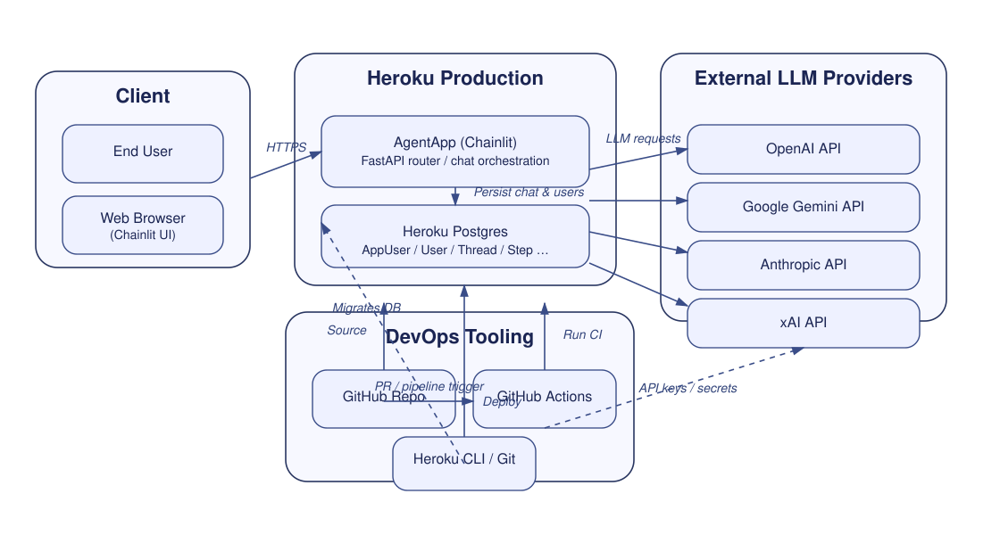
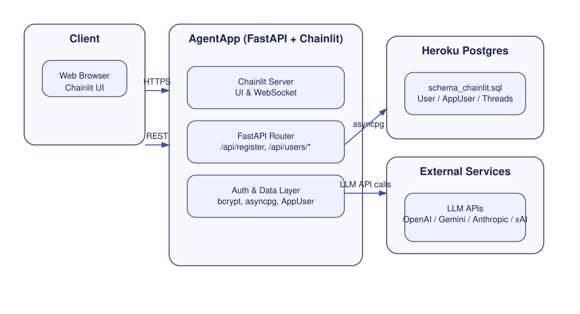
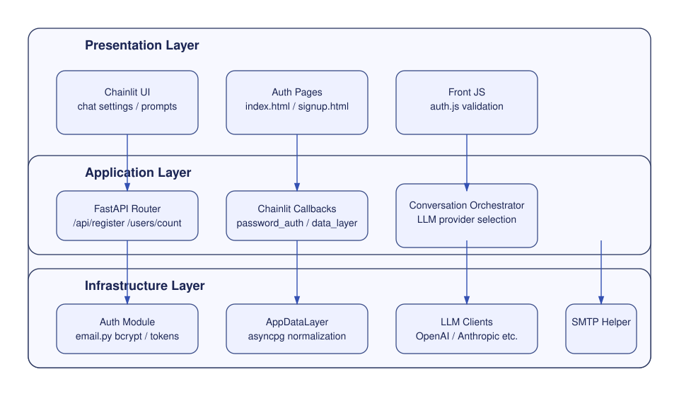
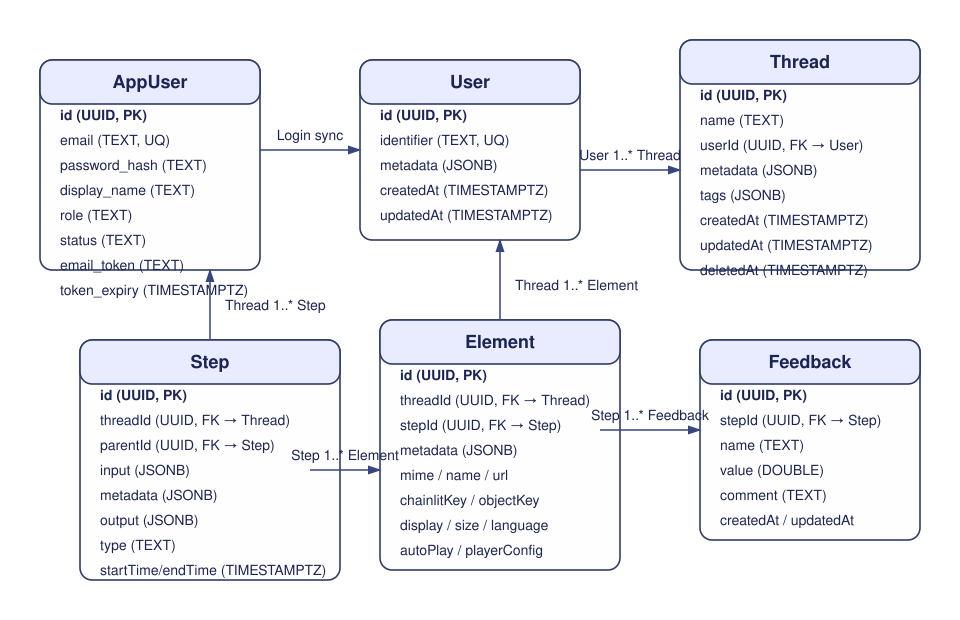
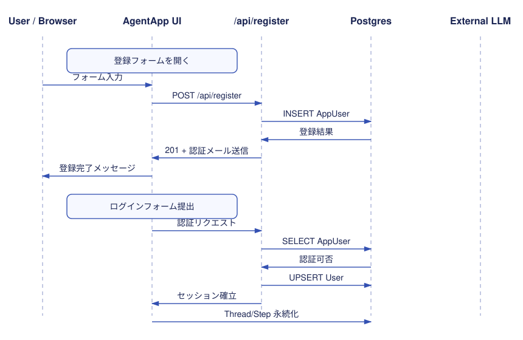
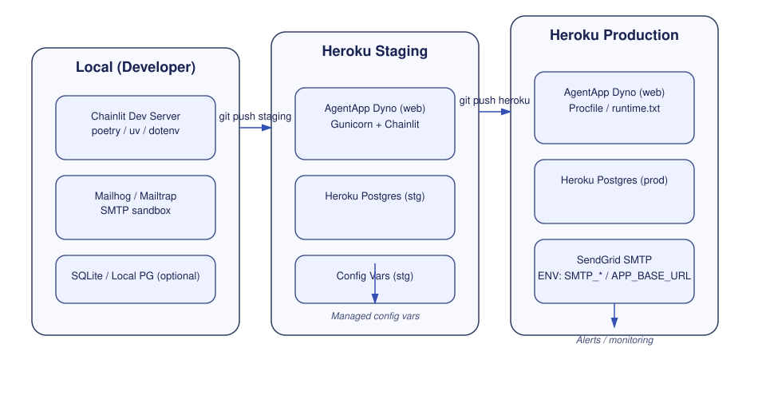
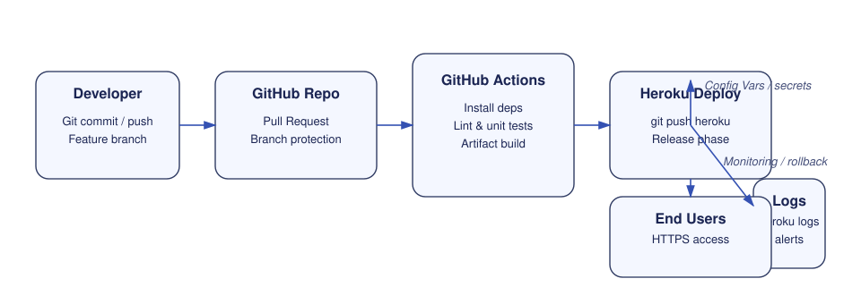

# Welcome to AgentApp! 🚀🤖

Hi there, Developer! 👋 We're excited to have you on board. Chainlit is a powerful tool designed to help you prototype, debug and share applications built on top of LLMs.

# AgentAppアプリケーションの詳細アーキテクチャ

### コンテキスト図  
  

### **コンテナ図（C4-L2）**
    
    目的：UI/API/DB/ジョブ/ストレージなど実体の分割。
    
    成果物：各コンテナの責務、通信、認証方式、環境変数。
    
  
    
### **コンポーネント図（C4-L3）**
    
    目的：バックエンド内部の層分割。
    
    成果物：`auth`、`conversation`、`provider`、`storage`、`telemetry`の依存関係。
    
  

### **ERD（データモデル）**  
  目的：永続化の正規化と索引設計。  
  成果物：主キー/外部キー/ユニーク制約/主要インデックス。  
  

### **シーケンス図：登録→ログイン→会話保存**  
  目的：認証と永続化のI/O順序を固定。  
  

### **メール認証設定メモ**

- `.env` あるいは Heroku Config Vars に `EMAIL_VERIFICATION_REQUIRED` を追加。  
- `true`（デフォルト）の場合はトークン発行→メール認証が完了するまでログイン不可。  
- `false` にするとメール送信をスキップし、登録直後に `status=active` でログイン可能（ローカル検証向け）。

### **デプロイ／実行環境図（Deployment）**
    
    目的：環境別（local/stg/prod）と接続経路。
    
    成果物：PaaS、DB、接続プール、Secretsの所在。
    
  
    
### **CI/CDパイプライン図**  
  目的：テスト→ビルド→マイグレーション→リリースの順序とゲート。  
  成果物：E2Eの場所、ロールバック手順。  
  
    
# Progress
- JUL 2025: AgentApp OSS版リリース
- OCT 2025: AgentApp Herokuデプロイ&リリース
- OCT 2025: AgentApp 会員登録機能の追加

### 実装中の機能
| 状態 | 進捗 |
|------|------|
| メール認証機能 | ████████░░ 80% |
| マルチエージェント機能 | ███░░░░░░ 30% |
